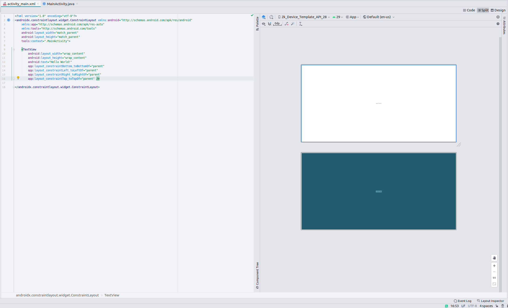

# emulator-device-config-generator

The project is a tool to generate emulator device config file for `Android Studio`. 
When we develop the app with `Android Studio`, we will select the virtual emulator
or real emulator target to preview the page xml. In most occasion, the built-in
emulator target for virtual emulator and real emulator can satisfy the need. But when
we develop app for custom device, for example a self built device, we should create
emulator config based on current built-in emulator config. We should export one template,
and then modify the exported xml file. The project provides a ugly UI to modify the
value of emulator config file.

The `Android Studio` can also modify many values of emulator config, but it doesn't provide
entry to modify the element such as `screen-density`. The project will provide it, and
provide the supported value based on emulator config specification.

The project is not useful for normal app developer, but it will be useful for system app
developer for their company custom devices.

### Prerequisite

`OpenJDK 11` and `openjfx 11`

### Build

`./gradlew build`

### Run

`./gradlew run`

### Test

`./gradlew test`

### Usage

The following diagram show the `Android Studio` preview with the generated 2k device based
on automotive template:
